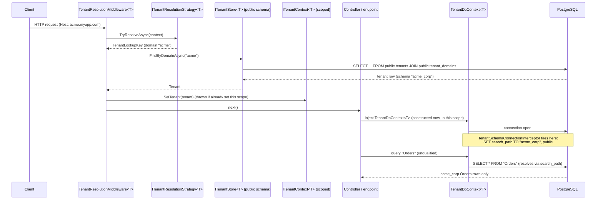

# Architecture

`EfCore.MultiTenancy` provides schema-based multi-tenancy for PostgreSQL on
.NET/EF Core, in the spirit of Python's `django-tenants`: one PostgreSQL database,
one schema per tenant, a "public" schema for the shared tenant registry, and
automatic routing of each request to the right schema.

This document explains how the pieces fit together, and is explicit about the three
places where isolation *actually broke* during development before the fixes
described below went in. Each was found only by running the sample against a real
Postgres instance and inspecting the database directly, not by reading the code or
by a unit test. If you fork or extend this library, re-run that same kind of
end-to-end check before trusting a change to the isolation-critical path.

## Project layout

```
src/
  EfCore.MultiTenancy.Core/       Tenant model, ITenantContext, lifecycle events.
                                   No EF Core or ASP.NET Core dependency.
  EfCore.MultiTenancy.EfCore/     TenantDbContext, the search_path interceptor,
                                   provisioning, migration.
  EfCore.MultiTenancy.AspNetCore/ Middleware, resolution strategies, the
                                   AddMultiTenancy DI wiring.
samples/SampleApi/                Minimal Web API: create a tenant, migrate it,
                                   hit a tenant-scoped endpoint via subdomain.
tests/
  EfCore.MultiTenancy.UnitTests/         Fast, no database.
  EfCore.MultiTenancy.IntegrationTests/  Testcontainers-backed real PostgreSQL.
```

`Core` has no dependency on EF Core or ASP.NET Core. `ITenant`, `ITenantContext<T>`
and the lifecycle events are pure abstractions, so a consumer could in principle
build a non-EF-Core or non-HTTP host on top of them.

## Two kinds of data, two DbContexts

- **`TenantStoreDbContext<TTenant>`**: the tenant registry. Always pinned to the
  `public` schema via `HasDefaultSchema("public")`. Because of that, every table
  reference it generates is schema-qualified in the actual SQL (`"public"."tenants"`),
  so this context's queries are correct **regardless of what `search_path` a pooled
  connection happens to carry**. It never depends on session state for correctness.
- **`TenantDbContext<TTenant>`** (you derive your own context from this): a
  tenant's isolated data. Deliberately has **no** default schema and **no**
  schema-qualified table names. The same compiled model and the same migrations run
  against every tenant; PostgreSQL's `search_path`, set per-connection by the
  library, decides which physical schema `"Orders"`, `"Customers"`, etc. resolve to.

This split is the whole trick: one schema's queries are qualification-safe by
construction, the other's isolation is search_path-safe by an invariant the library
enforces on every single connection open (below).

## How schema switching actually works

`TenantSchemaConnectionInterceptor<TTenant>` (`Microsoft.EntityFrameworkCore.Diagnostics.DbConnectionInterceptor`)
runs `SET search_path TO "<tenant_schema>", public` on **every** `ConnectionOpened`/
`ConnectionOpenedAsync` callback for a `TenantDbContext<TTenant>`, unconditionally,
every time, with no "skip if unchanged" shortcut.

That "every time, no shortcut" detail is not a style choice; it is the actual safety
mechanism. Physical connections come from Npgsql's ADO.NET connection pool, and
Npgsql does **not** reset session-level state (like a previous tenant's
`search_path`) when a connection returns to the pool. If the interceptor ever
skipped re-applying `search_path` because "it's probably still right," a connection
recycled from Tenant A's last request into Tenant B's request would silently keep
querying Tenant A's schema. Always overwriting it on open is what makes reusing
pooled connections across tenants safe at all.

A `TenantDbContext<TTenant>` is registered via plain `AddDbContext`, never
`AddDbContextPool`. `AddDbContextPool` reuses the same `DbContext` *instance* across
requests; this library's connection string and interceptor are built fresh per
scope from that scope's resolved tenant, so pooling the context itself would freeze
one tenant's wiring onto a context object a later, unrelated request could reuse.

## The scoped tenant context, and why it is split into two interfaces

`ITenantContext<TTenant>` (read-only: `Current`, `HasTenant`, `Require()`) and
`ITenantContextSetter<TTenant>` (write-only: `SetTenant`, callable at most once per
scope) are two interfaces backed by **one** scoped instance, `TenantContext<TTenant>`.
Application code only ever injects the read-only interface; only the resolution
middleware and the background tenant-scope factory take a dependency on the setter.
A second `SetTenant` call in the same scope throws: there is no code path, anywhere
in the library, by which a scope's tenant can be silently reassigned mid-flight.

There is no static or `[ThreadStatic]` "current tenant" anywhere in this library.
Everything routes through DI scopes.

## Request lifecycle



Everything after `SetTenant`, meaning the `TenantDbContext<T>` construction, the
connection open, and the `search_path` switch, happens lazily, inside the same DI
scope the middleware set the tenant on. There's no separate "apply tenant" step to
forget.

## Provisioning and migration

`ITenantProvisioningService<TTenant>.CreateTenantAsync`:

1. Validates/derives the schema name (`SchemaNameValidator`, see below) and writes
   the tenant plus its primary domain into `TenantStoreDbContext` (`public` schema).
2. `ITenantSchemaProvisioner<TTenant>.CreateAsync` runs `CREATE SCHEMA IF NOT EXISTS`
   via a raw connection (the schema doesn't exist yet, so it can't go through the
   tenant `DbContext`).
3. Raises `OnTenantCreatedAsync` from a DI scope already bound to the new tenant
   (via `ITenantScopeFactory<TTenant>`), so a handler that needs
   `ITenantContext<TTenant>` sees the right tenant. No tables exist yet at this
   point, so this is not the place to seed data through a `DbContext`.
4. `ITenantMigrator<TTenant>.MigrateTenantAsync` applies EF Core migrations to the
   new schema, then raises `OnTenantMigratedAsync`, again from a tenant-bound
   scope. This time tables do exist, so a handler can safely inject the
   tenant-scoped `DbContext` to seed data (see `SampleApi`'s `SeedTodosOnTenantCreated`).

`ITenantMigrator<TTenant>.MigrateAllTenantsAsync` iterates every active tenant from
`ITenantStore`, migrating each in its own scope; one tenant's migration failure is
captured in the returned summary rather than aborting the batch.

## Schema name validation: the SQL-injection guard

Schema names come from user-controlled input (a tenant's chosen name, ultimately) and
get interpolated directly into raw SQL: `SET search_path`, `CREATE SCHEMA`,
`DROP SCHEMA`. That's because PostgreSQL has no bind-parameter syntax for identifiers
or session GUCs. **Every** call site that builds this SQL runs the value through
`SchemaNameValidator.Validate` first, which enforces `^[a-z_][a-z0-9_]*$`, a 63-byte
length cap (Postgres's own identifier limit), and a reserved-name blocklist
(`public`, `pg_*`, `information_schema`). This validation is deliberately
centralized in `Core` rather than re-implemented at each of the several places
(the interceptor, the provisioner, the connection-string provider) that need it.

## Three real isolation/correctness bugs found while building this

Documented here rather than only in commit history, because each is the kind of
mistake that's easy to reintroduce and hard to notice without an end-to-end test
against a live database:

1. **EF Core does not auto-discover interceptors from the app's DI container.**
   The first implementation registered the search_path interceptor as
   `services.AddScoped<IInterceptor, ...>()` on the theory that
   `UseApplicationServiceProvider` would make EF Core pick it up automatically. It
   does not, confirmed against EF Core's own docs. Every tenant's connection
   silently kept whatever `search_path` a pooled connection happened to already have,
   and two tenants' data visibly merged in query results. The fix is to explicitly
   resolve the interceptor and call `options.AddInterceptors(...)` inside the
   `AddDbContext` factory. `IDbConnectionInterceptor` is not one of EF Core's
   "singleton-category" interceptors (confirmed against the interceptors doc's own
   table), so a fresh, tenant-bound instance per `DbContext` is the correct,
   supported pattern here, not a "many internal service providers" foot-gun.

2. **Npgsql's migrations-history existence check is hardcoded to the `public`
   schema**, independent of `search_path`. With two tenant schemas plus the
   registry all defaulting to a table literally named `__EFMigrationsHistory`, the
   *second* tenant's `Database.MigrateAsync()` found `public.__EFMigrationsHistory`
   (belonging to the tenant registry's own migration), read a migration ID that
   happened to already be marked "applied" there, and concluded, silently, with no
   error, that its own migration was already applied. Its tables were never
   created. The fix: `AddTenantDbContext` explicitly pins the migrations-history
   table to the current tenant's own schema via
   `npgsql.MigrationsHistoryTable(HistoryRepository.DefaultTableName, tenant.SchemaName)`,
   so each tenant schema tracks its own migration state independently, matching how
   its data tables already work.

3. **`ITenantScopeFactory<TTenant>` was registered `Scoped`**, which made it
   resolvable only from inside a scope that, by definition, doesn't need it to
   create one: exactly backwards for its purpose (bootstrapping a tenant-bound
   scope from a hosted service, CLI tool, or other root-level code with no ambient
   scope). It has no per-request state; its only dependency is the always-root-safe
   `IServiceScopeFactory`, so it is now registered `Singleton`.

If you change how the interceptor is wired, how migrations are configured, or how
scope factories are registered, re-run the integration tests
(`EfCore.MultiTenancy.IntegrationTests`, real Postgres via Testcontainers). Each of
these three bugs passed a `dotnet build` and would have passed a unit test built on
fakes.

## Limitations vs. django-tenants

- No built-in admin UI (django-tenants ships Django admin integration for free).
- No automatic tenant-aware static/media file routing.
- No built-in support for routing based on a *path segment* (e.g. `/t/acme/...`).
  Only subdomain, header, and claim strategies ship out of the box, though the
  `ITenantResolutionStrategy<TTenant>` extension point makes adding one straightforward.
- `TenantIsolationMode.DatabasePerTenant` is a secondary path built on the same
  connection-string-provider extensibility point; it has far less real-world
  exercise than schema mode in this codebase (the integration tests target schema
  mode). Validate it thoroughly before relying on it in production.
- No built-in tenant-aware background job scheduling; `ITenantScopeFactory<TTenant>`
  gives you the building block, but you wire up the actual job runner.
- No connection-string-per-tenant encryption/secrets-manager integration beyond
  whatever your `ITenantConnectionStringProvider` implementation does itself.

### Ideas for a v2

- A source generator or analyzer that flags a `TenantDbContext<T>` subclass calling
  `HasDefaultSchema` or `ToTable(..., schema: ...)`, since either breaks the
  search_path assumption silently.
- First-class support for tenant-scoped background jobs (e.g. a Quartz.NET or
  Hangfire integration that wraps each job execution in an `ITenantScopeFactory`
  scope automatically).
- A minimal admin API/UI for tenant CRUD, analogous to django-tenants' Django admin
  integration.
- Read-replica-aware connection routing per tenant.
- Tenant-level feature flags wired through the same lifecycle-event pipeline.
